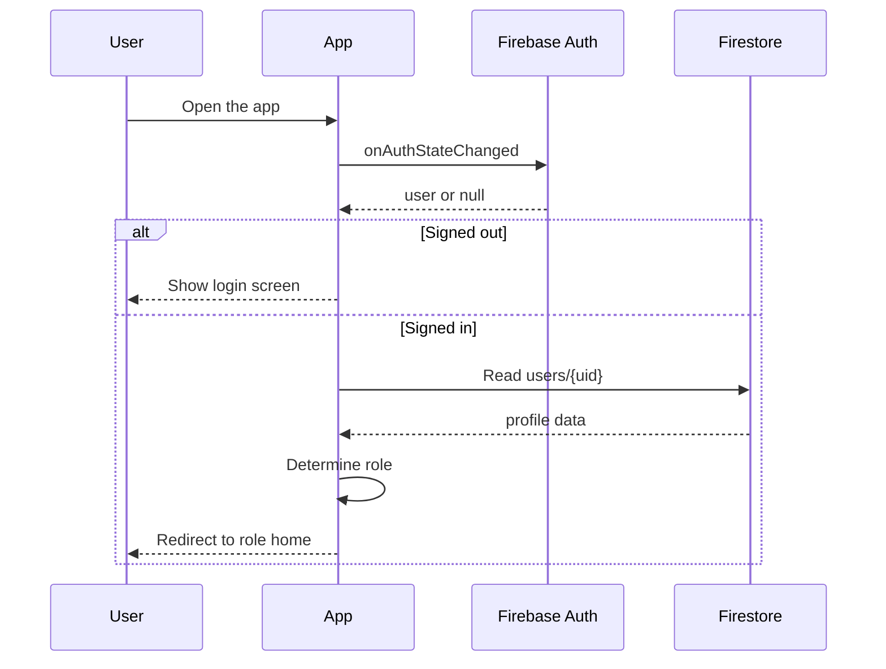

# Authentication and Navigation

This guide explains how the app decides who you are and where you should go after login.

## The short version

The mobile app does three things every time it starts:

1. Check whether Firebase says you are signed in.
2. Look up your Firestore profile to find your role.
3. Send you to the correct dashboard for that role.

## Main files involved

| File | What it does |
|------|---------------|
| `app/_layout.js` | Wraps the whole app in providers |
| `app/index.js` | Decides whether to show login or a role home screen |
| `app/(auth)/_layout.js` | Sets up the login and signup stack |
| `app/(app)/_layout.js` | Sets up the authenticated drawer navigation |
| `src/contexts/AuthContext.js` | Stores user state, role state, and auth actions |
| `src/hooks/useProtectedRoute.js` | Protects role-specific screens |
| `src/utils/roleUtils.js` | Validates roles and maps them to home screens |

## Authentication flow

## Login screen

`app/(auth)/login.js` is the sign-in screen.

What it does:

- Takes an email and password.
- Calls `signIn(email, password)` from `AuthContext`.
- Shows a loading state while the sign-in request is in flight.
- Displays a friendly alert if the sign-in fails.

If sign-in succeeds, the screen itself does not navigate. `app/index.js` handles the redirect after auth state updates.

## Signup screen

`app/(auth)/signup.js` creates a new Firebase auth user and a Firestore profile.

The screen asks for:

- email
- password
- role

Important note: the signup screen currently includes a role picker. In production, you should decide whether self-signup should be limited to driver accounts or whether privileged roles should be created through a trusted admin or owner workflow.

## Profile lookup and fallback behavior

After Firebase Auth says the user is signed in, the app reads the profile from:

1. `users/{uid}`
2. if that does not exist, the legacy `Users/{uid}` collection

If no profile can be found, the app falls back to the driver role.

If the profile exists but the status is not `active`, the user is signed out and shown an alert.

## Role mapping

| Role | Home route |
|------|------------|
| `admin` | `/admin` |
| `owner` | `/owner` |
| `operator` | `/operator` |
| `driver` | `/driver` |

The mapping comes from `src/utils/roleUtils.js`.

## Drawer navigation

`app/(app)/_layout.js` uses an Expo Router drawer.

The drawer is different for each role:

- Admin sees the admin dashboard.
- Owner sees the owner dashboard.
- Operator sees the operator dashboard.
- Driver sees the driver home, scan QR, and check-in confirm screens.

The drawer content also shows the signed-in email, the current role, and a sign-out button.

## Protected screens

`useProtectedRoute([...])` is the guard used by role screens.

It does two checks:

1. If the user is not signed in, it sends them to `/login`.
2. If the user has the wrong role, it sends them to their correct home screen.

This means a driver cannot stay on an admin screen by manually changing the route.

## Loading states

There are two kinds of loading in the auth flow:

- `initializing` means the app is still figuring out the current auth state.
- `loading` means the app is waiting for a profile lookup or auth action.

`app/index.js` shows a loading screen while initialization is still in progress.

## Why the auth flow is built this way

The goal is to avoid a confusing first screen.

Instead of making the user guess where to go, the app asks Firebase who they are and immediately sends them to the correct experience. That keeps the app simple for beginners and also keeps privileged screens out of the wrong hands.
